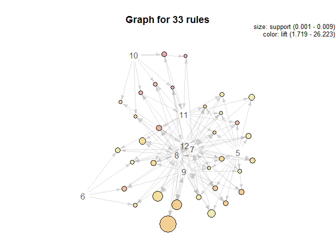
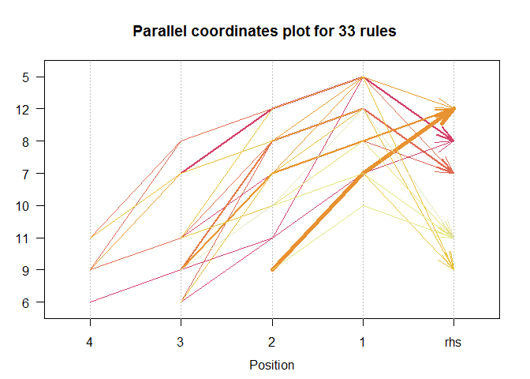

# Identifying Cross-Selling Opportunities
Shubhankar Gupta  
March 8, 2016  
I have used a Market Basket Analysis in R for the required solution.

Reading the data into R.

```r
product = read.table("ProductCategoryData.txt", header = T)
user = read.table("UserProfileData.txt", sep = "\t", header = T)
click = read.table("ClickStream.txt", sep = "\t", header=T)
```

```
## Warning in scan(file, what, nmax, sep, dec, quote, skip, nlines,
## na.strings, : number of items read is not a multiple of the number of
## columns
```

State/Region of Portugal have been recorded as numeric values. Therefore I have removed them for easier calculation. Also futher cleaning the data.

```r
click = click[,-(8:16)]
x = which(click$Region.State=="10")
b = which(click$Region.State=="11")
c = which(click$Region.State=="47")
d = which(click$Region.State=="")
click$Region.State = as.character(click$Region.State)
click = click[-c(x,b,c,d),]
click$Region.State = as.factor(click$Region.State)
click$Country = as.character(click$Country)
click$Country = as.factor(click$Country)
click$City = as.character(click$City)
click$City = as.factor(click$City)
```

We merge the data of product category and click stream by URL, to access the click on a particular product category.

```r
a1 = merge(click, product, by= "URL")
```

Now we merge the data of a1 and user profile by USER ID, to access the user who is clicking for the product category.

```r
a2 = merge(a1, user, by = "User.ID", all.x = T)
```

Market Basket Analysis is also called product association analysis.Association mining analysis mostly done based on an algorithm named "Apriori Algorithm".


```r
library(arules)
```

Now I converted the data frame into transaction class as per the requirements of **arules** package.

```r
a3 = a2[,-3]
data = a3[,(1:2)]
r = unique(data)
head(r)
```

```
##                                User.ID
## 1 002Y4OT6-5QCS-48PD-CDLK-0TSRUM620CLY
## 5 004906IP-LUPB-VM24-IO92-WE6X7FQL53N6
## 6 005O4L5Z-JUEX-BAPR-62BV-WGYFGA88C2TK
## 7 005O4L5Z-JUEX-BAPR-62BV-WGYFGA88C2TK
## 8 006EGSY4-FKS5-MT33-7TCF-RNHZL3EPJOXH
## 9 00BNYZVF-XUKN-DIUE-YSR1-RNYMDFSJVBGR
##                                                    URL
## 1 https://www.ideatory-store.com/SH51443900/VD30782423
## 5 https://www.ideatory-store.com/SH51443900/VD50250356
## 6 https://www.ideatory-store.com/SH51443900/VD05732995
## 7 https://www.ideatory-store.com/SH51443900/VD50250356
## 8 https://www.ideatory-store.com/SH51443900/VD30782423
## 9 https://www.ideatory-store.com/SH51443900/VD90147750
```

```r
spl = split(r$URL, r$User.ID)
trans = as(spl, "transactions")
df = data.frame(URL=levels(r$URL))
df$URL =as.character(df$URL)
level = merge(df,product, by="URL")
```

Using **support** for this transaction as 0.001 and **confidence** as 0.75 to get the association rules. As we will decrease confidence number of association rules will increase.

```r
rules = apriori(trans, parameter = list(supp=0.001, conf=0.75))
```

```
## Apriori
## 
## Parameter specification:
##  confidence minval smax arem  aval originalSupport support minlen maxlen
##        0.75    0.1    1 none FALSE            TRUE   0.001      1     10
##  target   ext
##   rules FALSE
## 
## Algorithmic control:
##  filter tree heap memopt load sort verbose
##     0.1 TRUE TRUE  FALSE TRUE    2    TRUE
## 
## Absolute minimum support count: 8 
## 
## set item appearances ...[0 item(s)] done [0.00s].
## set transactions ...[28 item(s), 8237 transaction(s)] done [0.00s].
## sorting and recoding items ... [18 item(s)] done [0.00s].
## creating transaction tree ... done [0.00s].
## checking subsets of size 1 2 3 4 5 done [0.00s].
## writing ... [33 rule(s)] done [0.00s].
## creating S4 object  ... done [0.00s].
```

```r
inspect(rules)
```

```
##    lhs            rhs  support     confidence lift     
## 1  {10,12}     => {11} 0.001942455 0.8000000  25.640467
## 2  {7,10}      => {11} 0.001092631 0.7500000  24.037938
## 3  {7,10}      => {8}  0.001092631 0.7500000   6.355710
## 4  {5,11}      => {7}  0.002428068 0.7692308   1.763472
## 5  {8,12}      => {9}  0.009226660 0.7916667  12.637516
## 6  {9,10,12}   => {11} 0.001092631 0.8181818  26.223205
## 7  {8,10,11}   => {12} 0.001335438 0.7857143  20.161771
## 8  {8,10,12}   => {11} 0.001335438 0.7857143  25.182601
## 9  {9,10,12}   => {8}  0.001092631 0.8181818   6.933502
## 10 {6,8,11}    => {7}  0.001821051 0.7500000   1.719385
## 11 {6,8,9}     => {12} 0.001821051 0.7500000  19.245327
## 12 {6,7,9}     => {8}  0.001214034 0.7692308   6.518677
## 13 {5,9,11}    => {12} 0.001214034 0.7692308  19.738797
## 14 {7,9,11}    => {8}  0.002913682 0.8275862   7.013197
## 15 {5,9,11}    => {7}  0.001214034 0.7692308   1.763472
## 16 {5,8,11}    => {7}  0.001578245 1.0000000   2.292513
## 17 {5,8,12}    => {9}  0.001942455 0.8421053  13.442676
## 18 {7,9,12}    => {8}  0.005098944 0.7777778   6.591107
## 19 {7,8,12}    => {9}  0.005098944 0.8076923  12.893336
## 20 {5,7,12}    => {9}  0.002185262 0.8181818  13.060782
## 21 {5,8,12}    => {7}  0.002063858 0.8947368   2.051196
## 22 {5,7,12}    => {8}  0.002063858 0.7727273   6.548307
## 23 {5,8,9}     => {7}  0.003520699 0.7631579   1.749550
## 24 {6,8,11,12} => {7}  0.001214034 0.7692308   1.763472
## 25 {7,9,11,12} => {8}  0.002185262 0.8571429   7.263668
## 26 {7,8,9,11}  => {12} 0.002185262 0.7500000  19.245327
## 27 {5,8,11,12} => {7}  0.001092631 1.0000000   2.292513
## 28 {5,7,11,12} => {8}  0.001092631 0.9000000   7.626852
## 29 {5,8,9,11}  => {7}  0.001092631 1.0000000   2.292513
## 30 {5,7,9,11}  => {8}  0.001092631 0.9000000   7.626852
## 31 {5,8,9,12}  => {7}  0.001821051 0.9375000   2.149231
## 32 {5,7,9,12}  => {8}  0.001821051 0.8333333   7.061900
## 33 {5,7,8,12}  => {9}  0.001821051 0.8823529  14.085157
```

Where these numbers correspond to a product category.

```r
level
```

```
##                                                     URL    Category
## 1                       https://www.ideatory-store.com/       books
## 2  https://www.ideatory-store.com/SH28141648/VD18727364    clothing
## 3  https://www.ideatory-store.com/SH28141648/VD75236732    clothing
## 4  https://www.ideatory-store.com/SH29978718/VD61428707 accessories
## 5  https://www.ideatory-store.com/SH51443900/VD05732995       shoes
## 6  https://www.ideatory-store.com/SH51443900/VD21190582      movies
## 7  https://www.ideatory-store.com/SH51443900/VD30782423    clothing
## 8  https://www.ideatory-store.com/SH51443900/VD50250356    handbags
## 9  https://www.ideatory-store.com/SH51443900/VD61965752 home&garden
## 10 https://www.ideatory-store.com/SH51443900/VD66504762       games
## 11 https://www.ideatory-store.com/SH51443900/VD90147750 electronics
## 12 https://www.ideatory-store.com/SH51443900/VD96818936   computers
## 13 https://www.ideatory-store.com/SH71385357/VD84093603  automotive
## 14 https://www.ideatory-store.com/SH71795094/VD85353798    handbags
## 15 https://www.ideatory-store.com/SH78531697/VD10477648    handbags
## 16 https://www.ideatory-store.com/SH78531697/VD99549384    handbags
## 17 https://www.ideatory-store.com/SH79068897/VD33761081       tools
## 18 https://www.ideatory-store.com/SH79068897/VD43931037    clothing
## 19 https://www.ideatory-store.com/SH81099722/VD38327020    handbags
## 20 https://www.ideatory-store.com/SH81099722/VD86857969    handbags
## 21 https://www.ideatory-store.com/SH87807518/VD50647383    clothing
## 22 https://www.ideatory-store.com/SH92865249/VD04293136    handbags
## 23 https://www.ideatory-store.com/SH94844021/VD23829396       shoes
## 24 https://www.ideatory-store.com/SH94844021/VD39965501    clothing
## 25 https://www.ideatory-store.com/SH94844021/VD47053396       shoes
## 26 https://www.ideatory-store.com/SH94844021/VD56960204       shoes
## 27 https://www.ideatory-store.com/SH94844021/VD72293071       shoes
## 28 https://www.ideatory-store.com/SH95413515/VD22615851    outdoors
```

Here are some Plots of the Rules we Obtained from the analysis.

```r
library(arulesViz)
```

```
## Warning: package 'arulesViz' was built under R version 3.2.4
```

```
## Loading required package: grid
```

```r
plot(rules)
```


```r
plot(rules, method="graph", control=list(type="items"))
```



```r
plot(rules, method="paracoord", control=list(reorder=TRUE))
```




